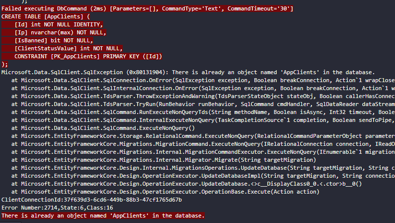

import { Steps, Aside } from '@astrojs/starlight/components';

My day-to-day responsibilities are to work on the tasks assigned to me.

These tasks include:
<Steps>
1. Working on a specific feature for one of our products (coding)
2. Researching a solution to a problem we need to solve
3. Researching new technologies that may benefit our day-to-day development experience
4. Researching other library management software vendors and how to integrate with them
</Steps>

I would say the most interesting aspect of my job is to gain access to existing codebases, many of which do not contain much documentation. While it is obviously not ideal to work in a codebase like this, it has allowed me to ameliorate my ability to read code and understand what it is doing. I think this skill will be very helpful in the future as I've heard many enterprise codebases are like this.

Another unique aspect of the job was working with software that actually has end-users. None of my side projects have had real users. Therefore, the change in requirements and priorities when developing software for the company was eye-opening and helped me understand how a business might approach software development.

In terms of the skills necessary for the coding portion of my job. The Winter 2024 semester equipped me with the necessary base skills the succeed in this role.

**CIS 2430** and **CIS 2750** provided me with a good understanding of **object-oriented programming** and **SQL** that accelerated my learning of other new technologies we used at work. C# and EntityFramework, respectively.

 
<Aside>
Pictured: me having lots of fun learning about EntityFramework and how SQL migrations work 🫠

</Aside>

